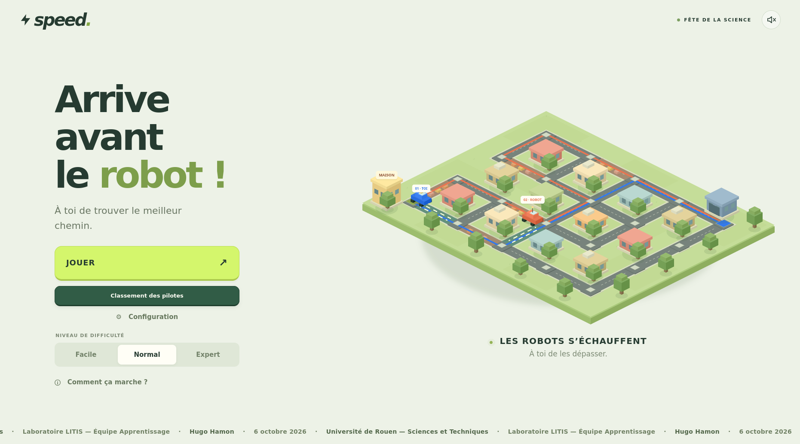

# Speed

Speed est un jeu de course de GPS, conçu pour la Fête de la science. L’objectif est de trouver un trajet rapide à travers une ville, puis de comparer son parcours à celui d’un robot pour découvrir les algorithmes de recherche de chemin.

Avec Python 3.11 ou plus récent, depuis la racine du projet, l’installation des dépendances avec pip et le lancement du jeu se font de la manière suivante :

```sh
python3 -m venv .venv
source .venv/bin/activate
python -m pip install -r requirements.txt
python app.py
```

Le navigateur s’ouvre sur [http://localhost:8000](http://localhost:8000). Le terminal doit rester ouvert pendant le jeu ; `Ctrl+C` arrête le serveur.

Pour jouer, il suffit de choisir un niveau, de préférence **Facile** pour commencer, puis de cliquer sur **JOUER**. Le trajet se construit en cliquant sur les carrefours voisins, du garage jusqu’au drapeau : les rues vertes sont rapides et les voitures orange signalent des ralentissements. **Annuler** permet de retirer la dernière étape. Une fois le trajet terminé, **Valider le trajet** lance la démonstration de recherche du robot, puis la course. Après l’arrivée, **Pourquoi ce chemin ?** permet d’observer le trajet optimal et **Nouvelle course** de recommencer.

Pendant la recherche du robot, des cases violettes carrées indiquent les zones examinées. Pour les robots à vision limitée, elles s’effacent à chaque décision ; pour Dijkstra, seules les cases récemment examinées restent colorées. Une cible indique le carrefour examiné à cet instant, dont le numéro apparaît dans le panneau. En fin de recherche, les couleurs s’effacent pour laisser le trajet lisible. Le trajet orange se construit au fil des décisions des robots à vision limitée ; avec Dijkstra, il se dessine du départ à l’arrivée une fois la recherche terminée. **Pause** permet d’observer la recherche, et **Passer à la course** lance directement la course.

Les cartes générées demandent au moins **4 clics en mode moyen** et **5 en mode difficile** pour saisir un trajet optimal, même avec les raccourcis sur les rues droites et dans les couloirs. Le mode facile conserve ses trajets plus simples.

Le mode moyen ajoute des feux tricolores. Le mode difficile conserve les feux et ajoute des trains sur la terre ferme ainsi que, sur les cartes avec rivière, des bateaux avec pont levant. Les cycles sont tirés au sort à chaque nouvelle manche et démarrent au départ commun des voitures : l’attente dépend de l’heure d’arrivée de chacune. Les voitures s’arrêtent réellement devant l’obstacle. Le temps annoncé du trajet, Dijkstra et les scores tiennent compte des mêmes cycles. Avant la course, le décor montre leur état initial.

Pour ralentir la disparition des cases de Dijkstra, modifier `DIJKSTRA_TRAIL_MIN_SECONDS` et `DIJKSTRA_TRAIL_MAX_SECONDS` dans `web/js/exploration.js` (maintien avant effacement), puis `HEAT_FADE_SECONDS` pour la durée du fondu, partagée par les robots.

## Aperçu

[](./docs/game.png)